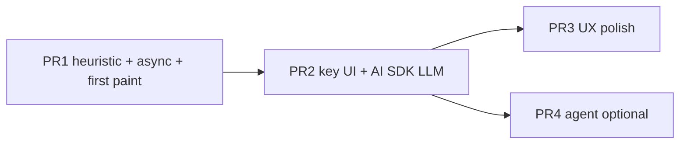

# Design: Client-Side Feed Personalization with Vercel AI SDK

| Field | Value |
|-------|--------|
| **Author** | TBD |
| **Date** | 2026-07-09 |
| **Status** | Implemented (PR1 + PR2 merged as a single change) |
| **Scope** | `src/lib/personalize.ts`, App wiring, API-key UX, tests |
| **Related** | [`src/lib/summarizer.ts`](src/lib/summarizer.ts) (narrow LLM interface pattern), [`src/App.tsx`](src/App.tsx), [Vercel AI SDK](https://ai-sdk.dev) |

---

## Overview

`personalize()` in [`src/lib/personalize.ts`](src/lib/personalize.ts) is a stub: it ignores `UserInterests` and returns the aggregated RSS feed unchanged. Users can already enter free-form interest tags (persisted under `vibe-feed:interests`), but those tags have no effect on order or relevance.

This design makes personalization real while staying client-only and dependency-light. Ranking becomes a **hybrid pipeline**: a deterministic keyword heuristic always works offline; when the user supplies a Gemini API key, a single Vercel AI SDK `generateText` + `Output.object` call reranks the feed in one batch (LLM code loaded via **dynamic `import()`** so key-less users do not pay the AI SDK bundle cost). On missing key or LLM failure, the app falls back to the heuristic (or pure chronological cold start). **Invariant: if `items.length > 0`, the UI never shows an empty feed solely because ranking is in flight or failed.**

---

## Background & Motivation

### Current state

| Layer | Behavior today |
|-------|----------------|
| Interests UI | `InterestsEditor` in `App.tsx`; tags in localStorage |
| Interest model | `UserInterests = { topics: string[] }`; cold start = `[]` |
| Ranking | Sync stub: `personalize(items, interests) => items` (identity / **arrival order** from `fetchAllFeeds` → `Promise.all` → `flat()`) |
| Call site | `useMemo(() => personalize(items, interests), …)` — cards appear as soon as RSS resolves |
| LLM pattern | Narrow `Summarizer` interface; `mockSummarizer` default always works |
| Backend | None — Vite SPA, browser-only |

Relevant code today:

```28:34:src/lib/personalize.ts
export function personalize(
  items: FeedItem[],
  interests: UserInterests
): FeedItem[] {
  void interests;
  return items;
}
```

```172:173:src/App.tsx
  // personalize() is a stub — returns items unchanged for now.
  const feed = useMemo(() => personalize(items, interests), [items, interests]);
```

The stub comment already points at treating ranking as an agent with tools via the Vercel AI SDK. That is a valid direction; this design evaluates it against a simpler batch structured-output path and picks the minimal approach that still uses the AI SDK and satisfies product constraints.

### Pain points

1. **Interests are theater** — UI and persistence exist; ranking does not use them.
2. **Sync API blocks real ranking** — any LLM or even non-trivial scoring should be async; the current `useMemo` path cannot load, cancel, or recover.
3. **No graceful degradation path for ranking** — summarizer already models “mock always works”; personalize has no equivalent.
4. **Feed quality** — with multiple sources (local mock + GitHub Blog + DEV.to), arrival order is noisy; topic tags should surface relevant items first.

### Constraints (from AGENTS.md + product)

- Minimal, dependency-light (including **bundle cost** for users without a model).
- No backend.
- App must remain useful without a real model.
- Match existing style (narrow interfaces, pure helpers, Vitest unit tests).
- Feed items: `id`, `title`, `link`, `content` (HTML), `publishedAt`, `sourceId`, `sourceTitle`.
- Typical feed size: tens of items (local mock ≈ 8; plus a handful per remote source) — not thousands.

---

## Goals & Non-Goals

### Goals

1. **Personalize by topics** — when `interests.topics` is non-empty, reorder items by relevance to those topics.
2. **Use Vercel AI SDK** for the LLM ranking path (`ai` + `zod` + `@ai-sdk/google`), loaded only when needed.
3. **Always-on fallback** — no API key, network error, structured-output failure, timeout, or abort-supersede → heuristic or chronological; **never blank a non-empty item list** because of ranking.
4. **Cold start** — empty topics **or no usable topics** (all tags length &lt; 2 after trim) → chronological (`publishedAt` desc, then stable original index), **no** LLM/heuristic ranking call. This is an **intentional behavior change** vs today’s identity/arrival order (see K3).
5. **Async, cancellable ranking** — replace sync `useMemo` with effect-driven async ranking; abort in-flight LLM work on supersede; show loading without clearing cards.
6. **Cost/latency discipline** — one batch LLM call per ranking; truncate content; debounce interest edits only.
7. **Testability** — heuristic/chrono/remap/compact unit-tested offline; LLM orchestration tested via injected `LlmRankFn`.

### Non-Goals

- Server-side ranking, auth proxy, or key vault.
- Changing RSS fetch/parser or feed source list (except as ranking input).
- Deduplication of near-duplicate articles (mock feed includes an intentional dup; out of scope unless a later PR).
- Replacing or merging with WebLLM summarizer.
- Multi-user accounts, collaborative filters, or long-term preference learning beyond free-form tags.
- Streaming partial rank updates to the UI (nice-to-have later).
- Full agent multi-tool exploration as MVP (documented as optional follow-up).
- Using AI SDK `rerank()` (no Gemini rerank model in free-tier scope for this app).

---

## Key Decisions

| # | Decision | Rationale |
|---|----------|-----------|
| K1 | **Hybrid ranking: keyword heuristic + optional single-shot LLM rerank** | Feed is tiny (~tens of items). One structured batch call is enough quality; multi-step agents add latency/cost/complexity without proportional gain. Heuristic alone satisfies “always works.” |
| K2 | **Async `personalize()` returning `Promise<PersonalizeResult>`** | LLM I/O is async; App must show ranking state and cancel on interest/item changes. |
| K3 | **Cold start = chronological (`publishedAt` desc), zero network — intentional departure from stub identity/arrival order** | Empty topics mean no ranking signal; chrono is a better default feed than arbitrary `Promise.all` flat order. Items with `publishedAt === 0` (parse failure in `rss.ts`) sort last; ties broken by original index for stability. |
| K4 | **User-supplied Gemini API key in localStorage; restricted-key hygiene** | Pure browser app cannot hide secrets. Document referrer/API restrictions, XSS exfil risk, trim-on-save, mask after save. Never commit keys. |
| K5 | **Orchestrator + explicit `LlmRankFn` injection (not a Summarizer clone, not `typeof defaultLlmRank`)** | Keeps `personalize.ts` free of static AI SDK imports; tests inject fakes; default impl lives in `personalizeLlm.ts` and is loaded dynamically. |
| K6 | **Structured output: ordered ids + optional score/reason; safe remap** | Unknown ids dropped; missing ids appended; dups first-wins; empty/null output treated as failure → heuristic. |
| K7 | **Optimistic paint by cause: items-change → chrono now; interests/key-only → SWR keep prev; never blank non-empty items** | When the **items id multiset** changes, immediately `setFeed(chronological(items))` (do not keep cards from a disjoint previous set). When only interests/apiKey change, keep previous ranked order while re-ranking. Ranking never sets `feed` to `[]` when `items.length > 0`. Debounce 0 ms on items change, 300 ms on interest/key. |
| K8 | **Deps: `ai`, `zod`, `@ai-sdk/google` — dynamically imported on key-present path only; pin majors in PR** | Dependency-light for the default offline experience; static import graph must not pull AI SDK into the main chunk. |
| K9 | **Agent-with-tools is Phase 2, not MVP** | Single `generateText`+`Output.object` first; agent later if needed. |
| K10 | **`personalize` almost never rejects** | Expected LLM failures (null output, `NoObjectGeneratedError`, network, 4xx, timeout) → resolve with heuristic + `warning`. Abort when superseded → resolve with previous path ignored by App (or soft chrono/heuristic) without `rankingStatus: "error"`. Only programmer bugs reject. |
| K11 | **AbortController + AI SDK `timeout` / `abortSignal` (not bare `Promise.race`)** | Cancel orphaned Gemini calls on debounced supersede; avoid stacked free-tier requests. |

---

## Proposed Design

### Architecture

```mermaid
flowchart TB
  subgraph UI["App.tsx"]
    IE[InterestsEditor]
    KEY[ApiKeySettings]
    FEED[Feed list — never blank if items non-empty]
    STATE[rankingStatus: idle / ranking / error]
  end

  subgraph LIB["src/lib"]
    RSS[rss.fetchAllFeeds]
    PERS[personalize]
    HEUR[heuristicRank]
    DYN["dynamic import personalizeLlm"]
    LLM[defaultLlmRank via AI SDK]
    COMPACT[compactItems]
    REMAP[remapRanking]
  end

  RSS --> items[(FeedItem[])]
  IE --> interests[(UserInterests)]
  KEY --> apiKey[(localStorage key)]
  items --> PERS
  interests --> PERS
  apiKey --> PERS

  PERS -->|topics empty| CHRONO[sort publishedAt desc + stable index]
  PERS -->|no key or force heuristic| HEUR
  PERS -->|key present| DYN --> COMPACT --> LLM
  LLM -->|success| REMAP
  LLM -->|failure / null / timeout| HEUR
  HEUR --> REMAP
  CHRONO --> FEED
  REMAP --> FEED
  PERS --> STATE
```

### Ranking strategy (chosen: hybrid)

**Path selection:**

```
if items.length === 0 → { items: [], mode: "chrono", metaById: empty }
effectiveTopics = trim + drop empty + drop length < 2
if effectiveTopics.length === 0 → chronological(items)   // cold start (no usable topics)
else if no usable API key or forceHeuristic → heuristicRank(items, effectiveTopics)
else → try llmRank(...); on any expected failure → heuristicRank(..., warning)
```

**Usable topics:** After normalization, if every tag is empty or length &lt; 2 (e.g. user only added `"a"`), treat as **cold start** (`mode: "chrono"`), not empty heuristic. Same path as truly empty `topics[]`.

**Invariant (orchestration):** `personalize` **resolves** for all expected paths when `items` is a finite array. It does not throw for LLM/network/parse/timeout failures. App’s `catch` is belt-and-suspenders only (programmer errors).

**Heuristic (`heuristicRank`)** — offline, pure:

1. Strip HTML from `content` (shared `toPlainText` in `src/lib/text.ts`, extracted from `App.tsx`).
2. **Normalize topics (caller or helper `effectiveTopics`):** trim; drop empty; drop length &lt; 2 after trim (avoids `"a"` / `"to"`-style false positives from free-form tags). Orchestrator returns chrono when the resulting list is empty (see path selection). Match case-insensitively on lowercased title/content. Document residual false-positive risk for short common substrings (e.g. `"ai"` matching inside longer words); optional ASCII word-boundary match is a later polish, not required for MVP.
3. For each item, score = sum over remaining topics:
   - title substring match: **+3** per topic
   - plain content substring match: **+1** per topic
4. Sort by score desc, then `publishedAt` desc, then **original index** asc (stable).
5. Items with score 0 remain in the list after scored items — **do not filter out**.
6. Populate `metaById` with simple reasons when score &gt; 0, e.g. `reason: "matched: AI, design"` (even if card UI for reasons lands in polish PR — aids tests and debugging).

**LLM (`llmRank` / `defaultLlmRank`)** — one batch call, **dynamically imported**:

1. Build **compact item cards** via `compactItems`:
   - `id`, `title`, `sourceTitle`
   - `publishedAt`: `item.publishedAt ? new Date(item.publishedAt).toISOString() : null` (FeedItem stores **unix ms**, not ISO)
   - `snippet` = plain text of content truncated to **~400 chars**
   - Cap: if &gt; 40 items, send top 40 by recency; remainder appended unranked after remap
2. Call Vercel AI SDK (exact majors pinned in package.json at implement time; prefer current stable AI SDK line, e.g. v7+ APIs):

```ts
import { generateText, Output } from "ai";
import { createGoogleGenerativeAI } from "@ai-sdk/google";
import { z } from "zod";

const RankedFeedSchema = z.object({
  ranking: z.array(
    z.object({
      id: z.string(),
      score: z.number().min(0).max(1).optional(),
      reason: z.string().max(200).optional(),
    })
  ),
});

const google = createGoogleGenerativeAI({ apiKey });
const { output } = await generateText({
  model: google(GEMINI_RANK_MODEL), // constant; confirm free-tier id at implement time
  output: Output.object({ schema: RankedFeedSchema }),
  // Prefer `instructions` over deprecated `system` (AI SDK current docs)
  instructions: `You rank news feed items for a reader. Prefer items matching their interests.
Return ALL provided item ids exactly once, best match first. Reasons must be short.`,
  prompt: JSON.stringify({ topics, items: compact }),
  abortSignal: signal,
  timeout: 15_000, // cancel + fail fast; do not use bare Promise.race without abort
});
```

3. **Failure handling inside `defaultLlmRank` / orchestrator** (uniform):
   - If `generateText` throws (`NoObjectGeneratedError`, network, 4xx/5xx, timeout, abort) → rethrow only to the orchestrator’s `catch`, which returns `heuristicRank` + `warning` (except **abort when superseded**: see below).
   - If `output` is `null` / `undefined` or `output.ranking` is missing / empty → treat as failure → heuristic + warning.
   - Never surface expected LLM failures as rejected promises from `personalize`.

4. **Remap safety** (`remapRanking(items, order)` pure helper):
   - Build `Map<id, FeedItem>` from input; track original index.
   - Walk `order`; for each known id not yet used, append that item + meta.
   - Append any input items the model omitted (preserve relative chrono among omitted).
   - Drop unknown ids; first occurrence wins on duplicates.
   - Result length always equals `items.length`.

### Dynamic import (bundle isolation)

```ts
// inside personalize() when apiKey present and !forceHeuristic and !options.llmRank
const { defaultLlmRank } = await import("./personalizeLlm");
// personalizeLlm.ts is the ONLY module that statically imports `ai`, `@ai-sdk/google`, `zod`
```

- **PR1** ships with zero AI SDK deps; main bundle ≈ unchanged.
- **PR2** adds AI SDK packages + `personalizeLlm.ts` + dynamic import path.
- Measure `npm run build` asset sizes before/after; acceptance: heuristic-only code path must not statically import `ai`.
- Residual risk: even with dynamic import, first use downloads a chunk — acceptable when user opts in with a key.

### Why not agent-with-tools as MVP?

The stub suggests tools like `scoreItem` / `rerank`. With modern AI SDK tool loops:

```ts
// Phase 2 sketch only — not MVP
import { generateText, Output, tool, isStepCount } from "ai";

await generateText({
  model: google(GEMINI_RANK_MODEL),
  tools: {
    listItems: tool({ /* return compact catalog */ }),
    scoreItem: tool({ /* score one id */ }),
  },
  output: Output.object({ schema: RankedFeedSchema }),
  stopWhen: isStepCount(8),
  instructions: `Rank feed for interests: ${topics.join(", ")}`,
  abortSignal: signal,
  timeout: 15_000,
});
```

| | Single structured batch | Agent + tools |
|--|-------------------------|---------------|
| Latency | 1 round-trip (~1–3s) | Multi-step (N tool rounds) |
| Cost | One completion | Higher token use |
| Code / tests | Simple inject of `LlmRankFn` | Mock tool loop + step limits |
| Quality at N≈20 | Sufficient if snippets are good | Marginal gain for this size |

**Decision:** ship hybrid single-shot first; swap `LlmRankFn` for an agent impl later without changing App or heuristic.

### Sequence (happy path with API key)

```mermaid
sequenceDiagram
  participant User
  participant App
  participant Personalize
  participant Heuristic
  participant Chunk as dynamic import personalizeLlm
  participant AISDK as Vercel AI SDK
  participant Gemini

  User->>App: feeds resolve (items non-empty)
  App->>App: immediately set feed = chronological(items), status=ranking
  App->>Personalize: personalize(items, interests, { apiKey, signal })
  alt topics empty
    Personalize-->>App: chrono, mode: chrono
  else no API key
    Personalize->>Heuristic: rank
    Heuristic-->>App: mode: heuristic
  else has API key
    Personalize->>Chunk: import("./personalizeLlm")
    Chunk->>AISDK: generateText + Output.object + abortSignal + timeout
    AISDK->>Gemini: compact items + topics
    alt success
      Gemini-->>AISDK: ranking[]
      AISDK-->>Personalize: output
      Personalize->>Personalize: remapRanking
      Personalize-->>App: mode: llm
    else null output / NoObjectGeneratedError / network / timeout
      Personalize->>Heuristic: rank
      Heuristic-->>App: mode: heuristic, warning set
    end
  end
  Note over App: abort on cleanup → ignore late result; no error flash
  App->>User: render cards (optional reason line)
```

### Module layout

```
src/lib/
  types.ts              # FeedItem (unchanged)
  text.ts               # toPlainText, truncate (shared)
  personalize.ts        # public API, chronological, heuristicRank, remapRanking, orchestrate
  personalizeLlm.ts     # ONLY static importer of ai / @ai-sdk/google / zod
  apiKey.ts             # read/write/clear Gemini key (trim, reject empty)
```

- `personalize.ts` must **not** statically import `personalizeLlm.ts` (type-only imports of shared types are fine if they do not pull runtime).
- Default LLM entry: dynamic `import("./personalizeLlm")` or injected `options.llmRank`.

### Async boundary & App wiring

**Before:**

```ts
const feed = useMemo(() => personalize(items, interests), [items, interests]);
```

**After (pattern — sketch matches the debounce table):**

```ts
const [feed, setFeed] = useState<FeedItem[]>([]);
const [rankMeta, setRankMeta] = useState<Map<string, RankMeta>>(new Map());
const [rankingStatus, setRankingStatus] = useState<"idle" | "ranking" | "error">("idle");
const [rankingMessage, setRankingMessage] = useState<string | null>(null);
const [apiKey, setApiKey] = useState(readApiKey);

/** Fingerprint of the current items multiset (order-independent enough for reload detection). */
function itemsKeyOf(list: FeedItem[]): string {
  return list.map((i) => i.id).join("\0");
}

const prevItemsKeyRef = useRef<string>("");
const prevInterestsKeyRef = useRef<string>("");
const prevApiKeyRef = useRef<string>("");

function modeHint(mode: PersonalizeMode, hasKey: boolean): string | null {
  if (mode === "heuristic" && !hasKey) {
    return "Ranked by keyword match (add an API key for LLM ranking)";
  }
  return null;
}

useEffect(() => {
  if (items.length === 0) {
    setFeed([]);
    setRankMeta(new Map());
    setRankingStatus("idle");
    prevItemsKeyRef.current = "";
    return;
  }

  const itemsKey = itemsKeyOf(items);
  const interestsKey = JSON.stringify(interests.topics);
  const itemsChanged = itemsKey !== prevItemsKeyRef.current;
  const interestsChanged = interestsKey !== prevInterestsKeyRef.current;
  const apiKeyChanged = apiKey !== prevApiKeyRef.current;

  // Optimistic paint (K7):
  // - items changed (first load or reload): always chrono of *new* items — never keep stale cards
  // - only interests/apiKey changed: keep previous ranked feed (true SWR) while re-ranking
  if (itemsChanged) {
    setFeed(chronological(items));
    setRankMeta(new Map());
  }
  // if !itemsChanged && prev feed non-empty: leave feed as-is (SWR)

  prevItemsKeyRef.current = itemsKey;
  prevInterestsKeyRef.current = interestsKey;
  prevApiKeyRef.current = apiKey;

  setRankingStatus("ranking");

  const ac = new AbortController();
  // Normative debounce: 0 ms when items changed; 300 ms when only interests/apiKey changed.
  const delayMs = itemsChanged ? 0 : interestsChanged || apiKeyChanged ? 300 : 0;

  const handle = window.setTimeout(async () => {
    try {
      const result = await personalize(items, interests, {
        apiKey: apiKey || undefined,
        signal: ac.signal,
      });
      if (ac.signal.aborted) return; // superseded — do not flash error
      setFeed(result.items); // always length === items.length for finite inputs
      setRankMeta(result.metaById);
      setRankingStatus("idle");
      setRankingMessage(
        result.warning ?? modeHint(result.mode, Boolean(apiKey))
      );
    } catch (e) {
      if (ac.signal.aborted) return;
      // Unexpected only (K10). Prefer current items, not a stale prev set.
      setFeed(chronological(items));
      setRankingStatus("error");
      setRankingMessage(String(e));
    }
  }, delayMs);

  return () => {
    ac.abort(); // cancels in-flight generateText via abortSignal
    clearTimeout(handle);
  };
}, [items, interests, apiKey]);
```

**Debounce / abort / optimistic-paint rules (normative — table is source of truth):**

| Trigger | Optimistic paint | Debounce | Abort previous |
|---------|------------------|----------|----------------|
| `items` first becomes non-empty | `setFeed(chronological(items))` | **0 ms** | n/a |
| `items` id multiset changes (reload) | `setFeed(chronological(items))` — **discard previous feed** | **0 ms** | yes |
| only `interests` or `apiKey` change | **keep** previous ranked `feed` (SWR) | **300 ms** | yes |

Detection: compare `itemsKey = items.map(i => i.id).join("\0")` (and interests/apiKey refs) as in the sketch. Do **not** use “`prev.length > 0` ⇒ keep prev” — that keeps stale cards across reloads.

**Ranking never clears feed:** `setFeed([])` only when `items.length === 0`. While `rankingStatus === "ranking"`, show current `feed` (fresh chrono after items change, or previous ranked order after interest/key change) plus a “Ranking…” line.

**Superseded aborts:** do not set `rankingStatus: "error"`; do not apply late results.

### UI changes

1. **`ApiKeySettings` (collapsible, minimal)**  
   - Password-style input for new key entry  
   - Save: `trim()`; reject empty after trim; never `console.log` the key  
   - After save: show masked form (e.g. `••••` + last 4 chars) + Clear; do not re-echo full key into a controlled visible field  
   - Persist under `vibe-feed:gemini-api-key`  
   - Warning copy: *“Stored only in this browser. Any script on this origin (or XSS) can read it. Create a Google AI Studio key restricted to the Generative Language API and, when available, HTTP referrer for this site. Use a free-tier demo key — not a production secret.”*  
   - Link: https://aistudio.google.com/apikey  

2. **Ranking status**  
   - `Ranking…` when in flight  
   - Prefer `result.warning` when set (e.g. LLM failed → keyword fallback) — distinct from “no API key” mode hint  
   - `rankingStatus: "error"` only for unexpected rejects (rare if K10 holds)

3. **Optional relevance affordance**  
   - If `meta.reason` present, muted “Why: …” under card meta (polish PR)  
   - Heuristic still fills simple “matched: …” in `metaById` from PR1 for testability  

4. **Do not** block feed load on ranking — fetch feeds as today; optimistic chrono as soon as items exist.

### Caching ranking results (optional)

In-memory cache key: sorted topics + item ids fingerprint + mode. Skip for MVP if abort + debounce suffice.

### Latency / cost budgets

| Scenario | Target |
|----------|--------|
| Cold start (empty topics) | &lt; 5 ms (sort only) |
| Heuristic, ≤50 items | &lt; 20 ms |
| LLM rank, ≤30 items, flash model | &lt; 5 s typical; **timeout 15 s** via SDK → heuristic |
| Tokens in | topics + ~30 × (title + 400-char snippet) |
| Tokens out | ordered ids + short reasons |

**Timeout:** use AI SDK `timeout: 15_000` **and** App-provided `abortSignal`. Do **not** use bare `Promise.race` without abort (leaves orphaned Gemini calls and can stack requests under debounce).

---

## API / Interface Changes

### Public personalize API

```ts
// src/lib/personalize.ts — no static import of personalizeLlm / ai / zod
import type { FeedItem } from "./types";

export interface UserInterests {
  topics: string[];
}

export const EMPTY_INTERESTS: UserInterests = { topics: [] };

export type PersonalizeMode = "chrono" | "heuristic" | "llm";

export interface RankMeta {
  score?: number;
  reason?: string;
}

/** Explicit fn type — avoids typeof defaultLlmRank coupling and static LLM imports. */
export type LlmRankFn = (args: {
  items: FeedItem[];
  topics: string[];
  apiKey: string;
  signal?: AbortSignal;
}) => Promise<{ order: { id: string; score?: number; reason?: string }[] }>;

export interface PersonalizeOptions {
  /** Gemini API key from user settings. Absent/blank → heuristic. */
  apiKey?: string;
  /** Force heuristic even if key present (tests / debug). */
  forceHeuristic?: boolean;
  /** AbortSignal from App AbortController; forwarded to generateText. */
  signal?: AbortSignal;
  /** Inject LLM implementation for tests (bypasses dynamic import). */
  llmRank?: LlmRankFn;
}

export interface PersonalizeResult {
  items: FeedItem[];
  mode: PersonalizeMode;
  metaById: Map<string, RankMeta>;
  /** Non-fatal, e.g. "LLM failed; used keyword ranking" */
  warning?: string;
}

/**
 * Always resolves for expected ranking failures (K10).
 * result.items.length === items.length when items is finite.
 */
export async function personalize(
  items: FeedItem[],
  interests: UserInterests,
  options: PersonalizeOptions = {}
): Promise<PersonalizeResult>;

/** Pure helpers exported for unit tests */
export function chronological(items: FeedItem[]): FeedItem[];
export function effectiveTopics(raw: string[]): string[];
export function heuristicRank(
  items: FeedItem[],
  topics: string[]
): PersonalizeResult;
export function remapRanking(
  items: FeedItem[],
  order: { id: string; score?: number; reason?: string }[]
): PersonalizeResult;
```

**Note on K5 / Summarizer analogy:** This is an **orchestrator function** with injectable `LlmRankFn`, not a second `Summarizer`-style interface. Summarizer is per-card fire-and-forget; ranking is a single feed-level pipeline with fallback modes. Do not force a `Ranker { rank() }` abstraction unless a third implementation appears.

### LLM module (dynamic chunk)

```ts
// src/lib/personalizeLlm.ts
import type { FeedItem } from "./types";
import type { LlmRankFn } from "./personalize";

export interface CompactItem {
  id: string;
  title: string;
  sourceTitle: string;
  /** ISO-8601 string, or null when publishedAt === 0 / missing */
  publishedAt: string | null;
  snippet: string;
}

/**
 * publishedAt: item.publishedAt ? new Date(item.publishedAt).toISOString() : null
 * snippet: toPlainText(content).slice(0, maxSnippetChars ?? 400)
 * If items.length > 40, caller should pass already-capped list or compactItems caps by recency.
 */
export function compactItems(
  items: FeedItem[],
  maxSnippetChars?: number,
  maxItems?: number // default 40
): CompactItem[];

export const defaultLlmRank: LlmRankFn;
```

### Orchestration pseudocode (normative for failure paths)

```ts
/** Topics that actually participate in ranking (trim; drop empty and length < 2). */
export function effectiveTopics(raw: string[]): string[] {
  return raw.map((t) => t.trim()).filter((t) => t.length >= 2);
}

export async function personalize(items, interests, options = {}) {
  if (!items.length) {
    return { items: [], mode: "chrono", metaById: new Map() };
  }
  // Cold start if no usable topics — includes only-short tags like ["a"] → chrono, not empty heuristic.
  const topics = effectiveTopics(interests.topics);
  if (!topics.length) {
    return { items: chronological(items), mode: "chrono", metaById: new Map() };
  }
  if (!options.apiKey?.trim() || options.forceHeuristic) {
    return heuristicRank(items, topics);
  }

  try {
    const llmRank =
      options.llmRank ??
      (await import("./personalizeLlm")).defaultLlmRank;
    const { order } = await llmRank({
      items,
      topics,
      apiKey: options.apiKey.trim(),
      signal: options.signal,
    });
    if (!order?.length) {
      return {
        ...heuristicRank(items, topics),
        warning: "LLM returned no ranking; used keyword ranking",
      };
    }
    const remapped = remapRanking(items, order);
    return { ...remapped, mode: "llm" };
  } catch (e) {
    if (options.signal?.aborted) {
      // Superseded: still resolve so callers can ignore via abort flag
      return {
        ...heuristicRank(items, topics),
        warning: "Ranking cancelled",
      };
    }
    return {
      ...heuristicRank(items, topics),
      warning: `LLM failed; used keyword ranking (${summarizeError(e)})`,
    };
  }
}
```

### API key helper

```ts
// src/lib/apiKey.ts
export const API_KEY_STORAGE = "vibe-feed:gemini-api-key";

export function readApiKey(): string; // raw stored string or ""

/** trim; if empty after trim, clear storage and return false */
export function writeApiKey(key: string): boolean;

export function clearApiKey(): void;

/** For UI mask: last 4 chars only when length >= 4 */
export function maskApiKey(key: string): string;
```

### Breaking change

- Callers of sync `personalize(...)` must await. Only call site today is `App.tsx`; tests updated.
- Return type is `PersonalizeResult`, not `FeedItem[]`.
- Cold start order is chronological, not arrival identity.

---

## Data Model Changes

### No server schema

| Key | Value | Notes |
|-----|-------|-------|
| `vibe-feed:interests` | `{ topics: string[] }` | Existing |
| `vibe-feed:gemini-api-key` | string | New; trimmed; treat as secret-ish local preference |

### In-memory only

`PersonalizeResult.metaById` is not persisted.

### FeedItem shape

Unchanged (`types.ts`). Ranking metadata lives in App state beside items.

---

## Alternatives Considered

### A1. Pure agent with tools (scoreItem, listItems, finalize)

- **Pros:** Matches stub comment; flexible if ranking rules grow.
- **Cons:** Higher latency/cost; harder tests; overkill for N≈tens.
- **Verdict:** Phase 2 optional PR.

### A2. Per-item LLM score calls

- **Pros:** Simple map.
- **Cons:** N API calls, rate limits, cost.
- **Verdict:** Rejected.

### A3. Heuristic only (no AI SDK)

- **Pros:** Zero deps.
- **Cons:** Fails “use Vercel AI SDK” requirement.
- **Verdict:** Required as fallback / PR1, insufficient alone.

### A4. WebLLM on-device ranker

- **Pros:** No API key.
- **Cons:** Heavy; WebGPU gaps; out of “AI SDK” requirement.
- **Verdict:** Out of scope.

### A5. Remote backend ranker with server-held key

- **Pros:** Key not in browser.
- **Cons:** Violates no-backend.
- **Verdict:** Rejected.

### A6. AI SDK Core `rerank()` API

- **Pros:** Purpose-built ranking API in some providers.
- **Cons:** Provider-specific; no suitable Gemini free-tier rerank model in scope; still needs structured integration work; less control over id remap schema.
- **Verdict:** Rejected for this project; batch `generateText` + `Output.object` is the portable path.

### A7. Static import of AI SDK from `personalize.ts`

- **Pros:** Simpler import graph.
- **Cons:** Inflates default bundle for users who never paste a key; fights dependency-light goal.
- **Verdict:** Rejected in favor of **dynamic `import("./personalizeLlm")`** only on key-present path (K8).

### A8. Preserve arrival order on cold start (stub identity)

- **Pros:** Zero behavior change for empty topics.
- **Cons:** Arrival order is `Promise.all` nondeterminism across sources; chrono is more predictable and useful.
- **Verdict:** Rejected; **intentional** chrono cold start (K3), documented as a behavior change.

---

## Security & Privacy Considerations

| Threat / issue | Severity | Mitigation |
|----------------|----------|------------|
| API key visible in DevTools / any XSS or third-party script on origin | **High** (inherent) | User-pasted only; localStorage; UI + README warn; **restrict key in Google AI Studio** to Generative Language API + HTTP referrer when available; free-tier demo key only; never log key; mask in UI after save |
| Prompt injection via malicious RSS content | Medium | Model output = ordering only; remap known ids; never execute model text; truncate snippets |
| Data exfil: article text sent to Gemini | Medium (expected) | Opt-in via key; document titles/snippets leave device; heuristic path stays local |
| Key in git / CI | High if mishandled | No default key; localStorage only; README |
| Empty/whitespace keys | Low | `writeApiKey` trims; reject empty; treat blank like missing |
| Supply chain / large client deps | Low–Med | Pin majors; dynamic import so offline path stays light; npm audit |

**Auth model:** none. Single local user.

**Privacy default:** without a key, no third-party LLM traffic for ranking.

---

## Observability

1. **`console.debug` in dev** (gated): mode, item count, latency ms, fallback reason — **never** apiKey.
2. **UI:** `result.warning ?? modeHint(mode)`; “Ranking…” while in flight.
3. **Optional:** `performance.now()` for “Ranked in 1.2s”.

No alerting. Expected failures degrade to heuristic with warning.

---

## Testing Strategy

### Unit (Vitest, no network)

| Case | Expectation |
|------|-------------|
| Empty items | `[]`, chrono mode |
| Empty topics | Chronological by `publishedAt` desc; `mode: "chrono"` (**not** arrival identity) |
| Only short topics (e.g. `["a"]`, `["x", ""]`) | `mode: "chrono"` (effectiveTopics empty — not empty heuristic) |
| Mixed `publishedAt: 0` and valid dates | Zeros sort last; stable original index among ties |
| Topics + keyword in title | Match ranks first; heuristic without key |
| Content-only match weaker than title | Title match above content-only |
| Topic length &lt; 2 among longer tags | Short tags ignored; longer tags still score |
| `forceHeuristic: true` with key | Does not call injected `llmRank` |
| Injected `llmRank` success | Order follows ids; `mode: "llm"` |
| Injected `llmRank` throws | Heuristic + `warning`; **promise resolves** |
| Injected `llmRank` returns empty order | Heuristic + `warning` |
| Injected `llmRank` returns nullish | Heuristic + `warning` |
| LLM omits an id | Omitted item still present at end |
| LLM invents unknown id | Ignored |
| LLM duplicates id | First occurrence wins |
| `remapRanking` pure cases | Same as omit/dup/unknown |
| `compactItems` | HTML stripped; snippet ≤ max; `publishedAt` ISO or null; cap at 40 by recency |

### Mocking AI SDK

Prefer **`options.llmRank` injection** over `vi.mock("ai")`. Keep any real-module smoke thin and optional.

### What not to test in CI

Live Gemini calls. **Manual PR2 checklist:** browser call to Generative Language API succeeds (CORS), rank reorders with a real key, clear key → heuristic, fail key → warning + heuristic, **feed never empty while items loaded**.

### Update existing test

[`src/lib/personalize.test.ts`](src/lib/personalize.test.ts) identity expectation is replaced by async chrono/heuristic/injection suites.

---

## Rollout Plan

Natural flag = presence of API key.

| Stage | Behavior |
|-------|----------|
| 1. PR1 heuristic + async + first-paint invariant | Keyword personalization offline |
| 2. PR2 key UI + AI SDK LLM path (dynamic import) | Semantic rerank when key set |
| 3. PR3 reasons UX polish | Independent |
| 4. PR4 optional agent | Only if needed |

**Rollback:** revert PR; or clear API key → heuristic. No data migration.

**Docs:** README — get Gemini key, restrict key, security note, CORS smoke, summarizer independent of ranking.

---

## Risks

| Risk | Severity | Mitigation |
|------|----------|------------|
| First-load blank feed | **High** if mishandled | Optimistic chrono; never `setFeed([])` when items non-empty (Issue 1) |
| AI SDK in default bundle | **High** for dep-light goal | Dynamic import only on key path; measure build (Issue 2) |
| Orphaned / stacked Gemini calls | Medium | AbortController + SDK timeout/abortSignal (Issue 4) |
| Structured output null / NoObjectGeneratedError | Medium | Treat as failure → heuristic + warning; do not reject (Issue 3) |
| Gemini model id / CORS in browser | Medium | Pin model constant; **manual browser CORS smoke** before PR2 done |
| Free-tier rate limits | Medium | Debounce interests; abort previous; one call per attempt |
| Short-topic false positives | Low–Med | Skip topics length &lt; 2; document residual risk |
| Over-truncating snippets | Low | 400 chars + title; tune constant |

---

## Open Questions

1. **Model pin:** exact free-tier Gemini flash model id at implementation time — confirm in Google AI Studio; store as `GEMINI_RANK_MODEL`.
2. **Filter vs reorder:** MVP reorders only; hide low scores? Recommend **no**.
3. **AI SDK major:** pin the current stable major at implement time (docs evolve; use `instructions`, `timeout`, `abortSignal`, `Output.object` as specified here).
4. **Agent Phase 2 priority:** only if single-shot quality is poor.
5. **Provider flexibility:** Google-only for minimal deps (recommend).

---

## References

- [`src/lib/personalize.ts`](src/lib/personalize.ts) — stub + agent comment  
- [`src/lib/summarizer.ts`](src/lib/summarizer.ts) — narrow interface + mock-default pattern  
- [`src/App.tsx`](src/App.tsx) — interests persistence, sync `useMemo` call site  
- [`src/lib/types.ts`](src/lib/types.ts) — `FeedItem` (`publishedAt` unix ms)  
- [`src/lib/rss.ts`](src/lib/rss.ts) — arrival order via `Promise.all` + `flat`; `publishedAt: 0` on parse failure  
- [Vercel AI SDK — structured output](https://ai-sdk.dev/docs/ai-sdk-core/generating-structured-data) (`generateText` + `Output.object`)  
- [Google AI Studio](https://aistudio.google.com) — free-tier keys + API restrictions  
- Project constraints: `AGENTS.md`

**External residual risk (not verifiable from this repo alone):** Gemini free-tier model ids and `@ai-sdk/google` browser CORS to `generativelanguage.googleapis.com` — validate with a one-time manual smoke test in PR2.

---

## PR Plan

Incremental, independently reviewable. After every merge: tests green; **if `items.length > 0`, feed UI non-empty**.

### PR 1 — Async personalize API + chronological cold start + keyword heuristic + first-paint invariant

- **Title:** `feat(personalize): async API, chronological cold start, keyword ranking`
- **Files / components:**
  - `src/lib/personalize.ts` — `personalize()`, `chronological()`, `heuristicRank()`, `remapRanking()`, types including `LlmRankFn` (unused at runtime yet)
  - `src/lib/text.ts` — shared `toPlainText` / `truncate`
  - `src/App.tsx` — replace `useMemo`; optimistic chrono; debounce interests only; abort controller plumbing (no LLM yet)
  - `src/App.css` — ranking status
  - `src/lib/personalize.test.ts` — chrono (incl. `publishedAt: 0`), heuristic, short-topic skip, remap cases
- **Depends on:** none
- **Acceptance:**
  - `npm test` / `npm run build` green; **no new runtime deps**
  - Offline demo: set topics → keyword reorder; empty topics → chrono (not arrival identity)
  - **Feed never blanks** after RSS load while ranking status shows
- **Description:** Makes personalization real offline. Establishes K10-ready result shape and App SWR/first-paint rules. LLM not wired (`apiKey` ignored).

### PR 2 — API key UI + Vercel AI SDK LLM rerank (merged key + LLM path)

- **Title:** `feat(personalize): Gemini key settings + batch LLM rerank (AI SDK, dynamic import)`
- **Files / components:**
  - `package.json` / lockfile — pin `ai`, `zod`, `@ai-sdk/google` (compatible majors; document versions in PR)
  - `src/lib/apiKey.ts` — trim/reject empty, mask helper
  - `src/lib/personalizeLlm.ts` — `compactItems`, `defaultLlmRank` (`instructions`, `timeout`, `abortSignal`)
  - `src/lib/personalize.ts` — dynamic import orchestration; empty/null order → heuristic + warning; no throw on expected LLM failures
  - `src/App.tsx` — `ApiKeySettings`, pass key + signal; `result.warning ?? modeHint`
  - `src/App.css` — settings panel
  - Tests: inject `llmRank` throw/empty/success; compactItems unit tests; apiKey trim tests
  - `README.md` — key setup, **restrict key**, security, manual CORS/Gemini smoke checklist
- **Depends on:** PR 1
- **Acceptance:**
  - Bundle: main chunk does not statically include `ai` (dynamic import); report `dist` sizes before/after
  - Unit tests cover fallback without network
  - Manual: browser CORS smoke to Generative Language API; good key ranks; bad key → warning + heuristic; clear key → heuristic; **no orphaned spam** when rapidly editing tags (abort)
  - Feed never empty while items loaded
- **Description:** Single shippable LLM slice (avoids awkward “key UI that does nothing” intermediate). Dynamic import keeps PR1 users light.

*Rationale for merging former PR2+PR3:* repo is tiny; key UI without ranking is dead product surface and extra review cycle. Injection-based tests do not require the UI, but one PR ships a complete vertical.*

### PR 3 — Ranking UX polish (reasons, mode hints)

- **Title:** `feat(ui): relevance reasons on cards and clearer ranking mode copy`
- **Files / components:**
  - `src/App.tsx` — pass `RankMeta` into `Card`; “Why: …”
  - `src/App.css` — reason styles
- **Depends on:** PR 1 (heuristic reasons already in meta); PR 2 for LLM reasons in production
- **Acceptance:** reasons render when present; no algorithm changes
- **Description:** Light explainability only.

### PR 4 (optional) — Agent-style tool loop ranker

- **Title:** `feat(personalize): optional tool-loop ranker behind strategy flag`
- **Files / components:**
  - `src/lib/personalizeAgent.ts` — tools + structured final output
  - `src/lib/personalize.ts` — `strategy: "batch" | "agent"`
  - Tests with mocked tools
- **Depends on:** PR 2
- **Acceptance:** default remains batch; agent path offline-testable via injection
- **Description:** Only if product wants agent demo or batch quality is insufficient.

### Suggested merge order



**Minimum lovable slice:** PR1 + PR2.  
**Demo without any API key:** PR1 alone.
